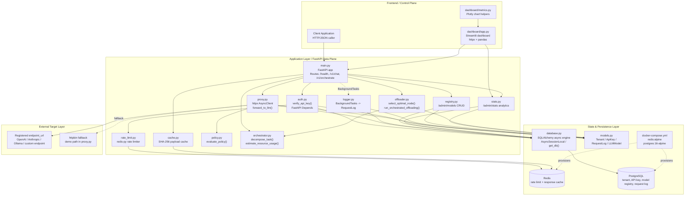
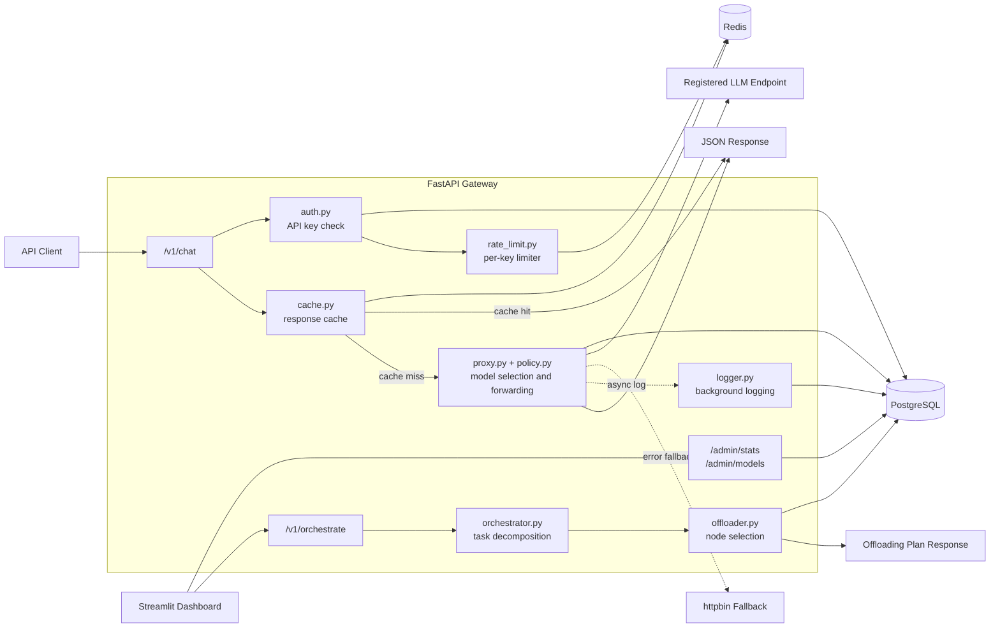
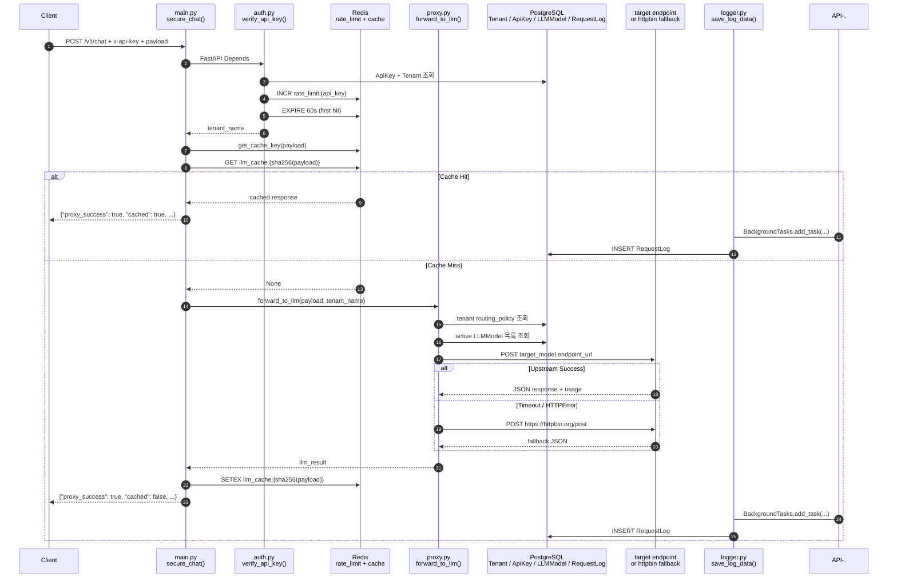
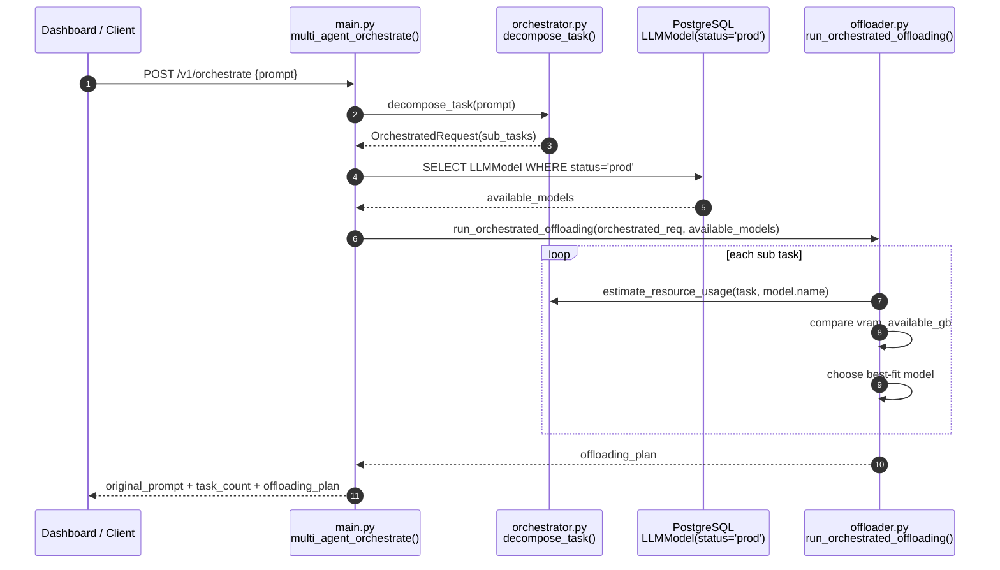
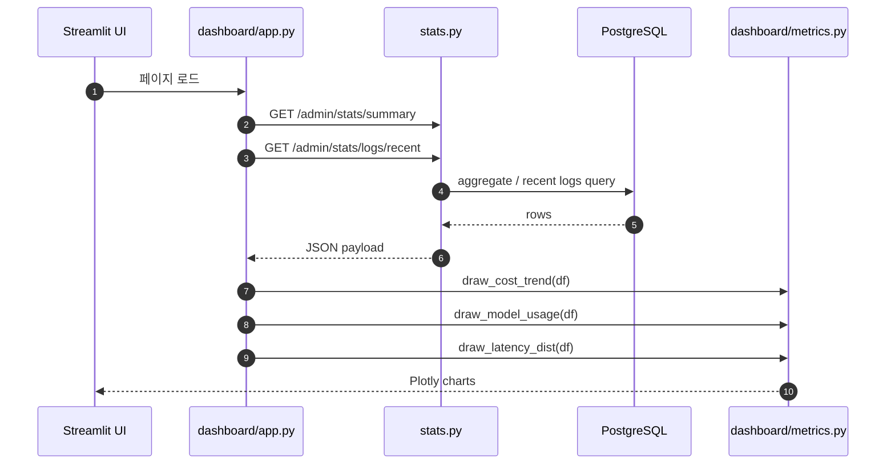

# 🏗️ LLM Gateway — 코드 기준 시스템 아키텍처 가이드

이 문서는 `llm-gateway` 저장소의 **현재 실제 소스코드**를 기준으로 시스템 아키텍처, 데이터 플로우, 폴더 구조를 정리한 문서입니다.

기존의 추상적인 목표 구조가 아니라, 지금 저장소에 존재하는 파일과 실제 호출 경로를 기준으로 정리했습니다.

---

## 1. 시스템 아키텍처 (System Architecture)

### 1.1 전체 구조도



### 1.2 스택과 소스코드 매핑

| 영역 | 사용 스택 | 실제 소스코드 |
|---|---|---|
| API 서버 | FastAPI, Uvicorn, Pydantic | `main.py`, `auth.py`, `registry.py`, `stats.py` |
| 외부 호출 | `httpx.AsyncClient` | `proxy.py` |
| 인증/인가 | FastAPI Depends, API Key 검증 | `auth.py` |
| 레이트 리밋 | Redis, `redis-py` | `rate_limit.py` |
| 응답 캐시 | Redis, SHA-256 payload hash | `cache.py` |
| 정책 라우팅 | Python rule engine | `policy.py`, `proxy.py` |
| 비동기 로깅 | FastAPI `BackgroundTasks` | `main.py`, `logger.py` |
| ORM / DB 액세스 | SQLAlchemy async, `asyncpg` | `database.py`, `models.py` |
| 모델 레지스트리 | REST admin API + PostgreSQL | `registry.py`, `models.py` |
| 통계 API | SQL aggregation + REST | `stats.py` |
| 오프로딩 시뮬레이션 | Pydantic models, resource estimation logic | `orchestrator.py`, `offloader.py` |
| 운영 대시보드 | Streamlit, pandas, Plotly, httpx | `dashboard/app.py`, `dashboard/metrics.py` |
| 인프라 실행 | Docker Compose, Redis, PostgreSQL | `docker-compose.yml` |

### 1.3 코드 기준 모듈 책임

| 모듈 | 역할 |
|---|---|
| `main.py` | FastAPI 앱 생성, 라우터 연결, `/v1/chat`, `/v1/orchestrate` 엔드포인트 제공 |
| `auth.py` | API Key를 DB에서 조회하고 팀 이름을 반환 |
| `rate_limit.py` | API Key 기준 분당 호출 횟수 제한 |
| `cache.py` | 요청 payload를 해시해서 Redis 캐시 조회/저장 |
| `proxy.py` | 정책 기반 모델 선택 후 외부 LLM endpoint로 요청 전달 |
| `policy.py` | `cost_optimal`, `quality_first`, `speed_optimal` 규칙 평가 |
| `logger.py` | 요청 결과를 `RequestLog` 테이블에 비동기 저장 |
| `database.py` | async engine / session factory / FastAPI dependency 제공 |
| `models.py` | 멀티테넌시, API Key, 로그, 모델 레지스트리 ORM 스키마 정의 |
| `registry.py` | 모델 목록 조회, 등록, 상태 변경 관리자 API |
| `stats.py` | 요약, 최근 로그, 모델 사용량, 비용 통계 API |
| `orchestrator.py` | 프롬프트를 하위 태스크로 분해하고 VRAM 사용량 추정 |
| `offloader.py` | 가용 모델 중 최적 노드 선택 및 오프로딩 계획 생성 |
| `dashboard/app.py` | 통계 API 호출 및 오프로딩 데모 UI |
| `dashboard/metrics.py` | 비용 추이, 모델 비중, 지연시간 분포 차트 렌더링 |

### 1.4 전체 워크플로우 한눈에 보기



---

## 2. 데이터 플로우 (Data Flow)

### 2.1 `/v1/chat` 요청 처리 시퀀스



### 2.2 `/v1/orchestrate` 오프로딩 시퀀스



### 2.3 운영 대시보드 데이터 조회 흐름



---

## 3. 폴더 구조 (Folder Structure)

### 3.1 구조도

```mermaid
flowchart TB
    Root["llm-gateway/"]

    subgraph RootFiles["Root Python Modules"]
        RootHub["root modules/"]
        MainFile["main.py<br/>FastAPI entrypoint"]
        AuthFile["auth.py<br/>auth dependency"]
        ProxyFile["proxy.py<br/>LLM forwarding"]
        RateFile["rate_limit.py<br/>Redis limiter"]
        CacheFile["cache.py<br/>response cache"]
        LoggerFile["logger.py<br/>DB logger"]
        DBFile["database.py<br/>async DB setup"]
        ModelsFile["models.py<br/>ORM schema"]
        RegistryFile["registry.py<br/>model admin API"]
        StatsFile["stats.py<br/>analytics API"]
        PolicyFile["policy.py<br/>routing rules"]
        OrchFile["orchestrator.py<br/>task decomposition"]
        OffloaderFile["offloader.py<br/>resource-based placement"]
        ComposeFile["docker-compose.yml<br/>infra definition"]
    end

    subgraph DashboardDir["dashboard/"]
        DashboardHub["dashboard/"]
        DashApp["app.py<br/>Streamlit app"]
        DashMetrics["metrics.py<br/>Plotly chart helpers"]
    end

    subgraph DocsDir["docs/"]
        DocsHub["docs/"]
        FinalDoc["final_architecture_overview.md"]
        ArchDoc["architecture.md"]
        EntDoc["enterprise_overview.md"]
        PhaseDoc["phase_analysis_report.md"]
        Roadmap["roadmap.md"]
        Steps["step1.md ~ step5.md"]
        DrawScripts["draw_arch.py / draw_arch2.py<br/>draw_ent_arch.py / draw_workflow.py"]
        Images["architecture_img.png<br/>ent_architecture_img.png<br/>ent_workflow_img.png"]
    end

    subgraph RuntimeDir["Local Runtime Artifacts"]
        RuntimeHub["runtime artifacts/"]
        Venv["venv/<br/>project-local virtualenv"]
        GitDir[".git/<br/>Git metadata"]
        PyCache["__pycache__/<br/>compiled Python cache"]
    end

    Root --> RootHub
    Root --> DashboardHub
    Root --> DocsHub
    Root --> RuntimeHub

    RootHub --> MainFile
    RootHub --> AuthFile
    RootHub --> ProxyFile
    RootHub --> RateFile
    RootHub --> CacheFile
    RootHub --> LoggerFile
    RootHub --> DBFile
    RootHub --> ModelsFile
    RootHub --> RegistryFile
    RootHub --> StatsFile
    RootHub --> PolicyFile
    RootHub --> OrchFile
    RootHub --> OffloaderFile
    RootHub --> ComposeFile

    DashboardHub --> DashApp
    DashboardHub --> DashMetrics

    DocsHub --> FinalDoc
    DocsHub --> ArchDoc
    DocsHub --> EntDoc
    DocsHub --> PhaseDoc
    DocsHub --> Roadmap
    DocsHub --> Steps
    DocsHub --> DrawScripts
    DocsHub --> Images

    RuntimeHub --> Venv
    RuntimeHub --> GitDir
    RuntimeHub --> PyCache
```



### 3.2 실제 트리 스냅샷

```text
llm-gateway/
├── auth.py
├── cache.py
├── database.py
├── docker-compose.yml
├── logger.py
├── main.py
├── models.py
├── offloader.py
├── orchestrator.py
├── policy.py
├── proxy.py
├── rate_limit.py
├── registry.py
├── stats.py
├── dashboard/
│   ├── app.py
│   └── metrics.py
├── docs/
│   ├── architecture.md
│   ├── draw_arch.py
│   ├── draw_arch2.py
│   ├── draw_ent_arch.py
│   ├── draw_workflow.py
│   ├── enterprise_overview.md
│   ├── final_architecture_overview.md
│   ├── phase_analysis_report.md
│   ├── roadmap.md
│   ├── step1.md
│   ├── step2.md
│   ├── step3.md
│   ├── step4.md
│   └── step5.md
├── venv/
├── .git/
└── __pycache__/
```

---

## 4. 문서 해석 가이드

- 이 문서는 `2026-04-01` 시점의 실제 저장소를 기준으로 작성했습니다.
- `memory_router.py`, `requirements.txt`, `dashboard/pages/` 같은 항목은 현재 저장소에는 없어서 구조도에 넣지 않았습니다.
- `/admin/models`, `/admin/stats`는 현재 코드상 별도 관리자 인증 없이 `main.py`에 연결되어 있습니다.
- `proxy.py`의 외부 호출 대상은 `LLMModel.endpoint_url`이며, 실패 시 `httpbin` fallback 경로가 존재합니다.
- 오프로딩 경로는 `orchestrator.py` + `offloader.py` 기반의 시뮬레이션 로직입니다.
