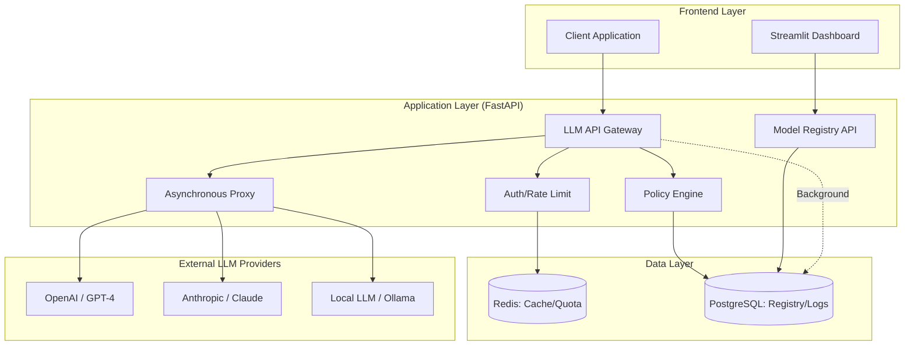
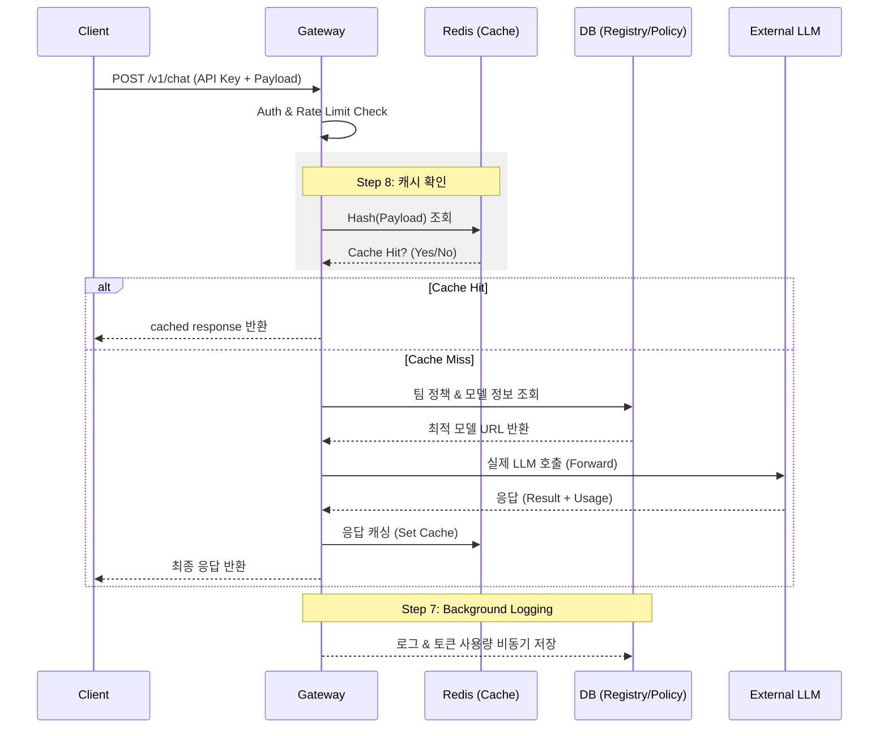

# 🏗️ Enterprise LLM API Gateway — 최종 아키텍처 가이드

모든 Phase(1~6)가 완료되었을 때의 최종 시스템 구조와 데이터 흐름, 그리고 프로젝트 폴더 구조를 정의한 문서입니다.

---

## 1. 시스템 아키텍처 (System Architecture)

전체 시스템은 **관리자 영역(Control Plane)**과 **트래픽 영역(Data Plane)**으로 나뉩니다.



---

## 2. 데이터 흐름 (Data Flow: Sequence)

요청이 들어와서 응답이 나갈 때까지의 전체 시퀀스입니다.



---

## 3. 폴더 구조 (Folder Structure)

Enterprise급으로 확장된 최종 프로젝트의 디렉토리 구조입니다.

```text
llm-gateway/
├── main.py              # 서비스 엔트리포인트 (FastAPI)
├── auth.py              # 인증 로직 (API Key, DB 연동)
├── proxy.py             # 비동기 LLM 프록시 & 로드밸런싱
├── rate_limit.py        # Redis 기반 트래픽 제어
├── logger.py            # 비동기 DB 로깅 (PostgreSQL)
├── database.py          # SQLAlchemy 엔진 및 세션 관리
├── models.py            # DB 스키마 (Tenant, ApiKey, RequestLog, LLMModel)
├── cache.py             # Redis 응답 캐싱 엔진
├── registry.py          # 모델 레지스트리 서비스
├── policy.py            # 스마트 라우팅 정책 엔진
├── memory_router.py     # (Deep Dive) 메모리 대역폭 기반 라우터
├── dashboard/           # Phase 4: 운영 대시보드 (Streamlit)
│   ├── app.py           # 대시보드 메인
│   └── pages/           # 통계/모델/비용 분석 페이지
├── docs/                # 프로젝트 문서화
│   ├── step1~15.md
│   ├── roadmap.md
│   └── architecture.md
├── docker-compose.yml   # 인프라 구성 (PostgreSQL, Redis)
└── requirements.txt     # 프로젝트 의존성
```

---

## 4. 핵심 컴포넌트 요약

| 모듈명 | 주요 역할 | 전공 연계 포인트 |
|---|---|---|
| **Auth & Rate Limit** | 테넌트별 호출 모델 및 분당 쿼리(RPM) 제한 | RC 회로(커패시터) 유사성 |
| **Model Registry** | 모델별 가용성 및 성능 메트릭 중앙 관리 | 메모리 어드레싱 |
| **Response Cache** | 동일 요청에 대한 고속 응답 제공 | LRU/LFU 캐시 알고리즘 |
| **Policy Engine** | 비용/속도/품질 기반 가중치 라우팅 | 결정 알고리즘 |
| **Background Logger** | 요청/응답 로그의 비동기 영속화 | DMA(Direct Memory Access) 패턴 |
| **Memory Aware Router** | HBM 대역폭 기반 실시간 부하 분산 | 메모리 병목 분석 |

---
