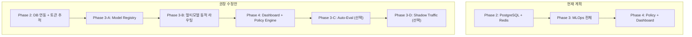

# 🔬 Phase 2~4 방향성 심층 분석 보고서

> **작성일**: 2026-03-27  
> **분석 대상**: [enterprise_overview.md](file:///home/mingun/AI_Flatform/llm-gateway/docs/enterprise_overview.md) + [architecture.md](file:///home/mingun/AI_Flatform/llm-gateway/docs/architecture.md)  
> **비교 기준**: 2025년 엔터프라이즈 LLM Gateway 업계 베스트 프랙티스

---

## 한 줄 결론

> **전체 방향은 올바릅니다. 다만 Phase 2에 빠져있는 핵심 기능이 있고, Phase 3의 범위가 포트폴리오 프로젝트로서는 과도하게 넓어 우선순위 조정이 필요합니다.**

---

## Phase 2: 인프라 고도화 (PostgreSQL + Redis 확장)

### 📋 현재 계획 내용
| 항목 | 내용 |
|------|------|
| PostgreSQL 연동 | 하드코딩된 API Key → DB 기반 테넌트(팀) 관리, 로그 영속 저장 |
| Redis 고도화 | 분산 Rate Limiting, 응답 캐싱(Semantic Caching) |

### ✅ 업계 표준과 일치하는 점
1. **DB 기반 테넌트 관리**: 멀티테넌시는 엔터프라이즈 LLM Gateway의 필수 기능이며, API Key를 DB로 관리하는 것은 정석입니다.
2. **Redis 캐싱**: 동일/유사 프롬프트의 응답을 캐싱하여 비용과 지연을 줄이는 것은 업계에서 **"Semantic Caching"** 이라 불리며, Portkey, LiteLLM 등 모든 상용 게이트웨이가 제공하는 핵심 기능입니다.
3. **비동기 로깅 영속화**: Step 5에서 콘솔에 찍던 로그를 PostgreSQL에 실제 저장하는 것은 당연한 진화입니다.

### ⚠️ 보완이 필요한 점

> [!IMPORTANT]
> **빠져있는 핵심 기능: 토큰 사용량 추적(Token Usage Tracking)**

현재 계획에는 "호출 로그"만 있고, **토큰 단위의 비용 추적**이 없습니다. 업계 표준에서는 다음이 필수입니다:

```
요청 로그에 반드시 포함해야 할 필드:
- prompt_tokens (입력 토큰 수)
- completion_tokens (출력 토큰 수)
- model_name (사용된 모델)
- estimated_cost (예상 비용, 모델별 단가 × 토큰 수)
```

이것이 있어야 나중에 **"팀별 월간 AI 비용 리포트"** 같은 대시보드가 가능해지고, 포트폴리오의 차별점이 됩니다.

> [!TIP]
> **추가 권장: Alembic(DB 마이그레이션 도구) 도입**
> 
> PostgreSQL 스키마를 코드로 관리하면 "인프라를 코드로 다루는 능력(IaC)"을 보여줄 수 있어 포트폴리오 가치가 올라갑니다.

### 위험도: 🟢 낮음
기존 코드 구조(`auth.py`의 Depends 패턴)가 잘 설계되어 있어, DB 연동으로 전환해도 `verify_api_key` 함수 내부만 바꾸면 되기 때문에 파급 효과가 적습니다.

---

## Phase 3: MLOps (Model Registry + Auto-Eval + Shadow Traffic)

### 📋 현재 계획 내용
| 항목 | 내용 |
|------|------|
| Model Registry | 모델 메타데이터 + 상태(dev/staging/prod) 중앙 관리 |
| Auto-Eval Pipeline | 신규 모델 등록 시 벤치마크 자동 평가 |
| Shadow Traffic | 실제 트래픽 일부를 staging 모델로 미러링 |
| Auto-Rollback | 에러율/지연시간 기준 자동 롤백 |

### ✅ 업계 표준과 일치하는 점
1. **Model Registry**: AWS SageMaker, MLflow, 그리고 Portkey 같은 상용 LLM Gateway 모두 제공하는 핵심 기능입니다. `dev → staging → prod` 생애주기가 업계 표준과 정확히 일치합니다.
2. **Shadow Traffic / A·B 테스트**: Netflix, Google 등 빅테크에서 새로운 ML 모델 배포 시 반드시 거치는 프로세스입니다. 이것을 구현하면 **ML 엔지니어링 역량**을 강하게 어필할 수 있습니다.
3. **Auto-Rollback**: 에러율/지연시간 기반 자동 롤백은 SRE(Site Reliability Engineering) 분야의 핵심 패턴입니다.

### ⚠️ 보완이 필요한 점

> [!WARNING]
> **범위가 너무 넓습니다 — 우선순위 분리가 필요합니다**

Phase 3에 4개 기능(Registry, Auto-Eval, Shadow Traffic, Auto-Rollback)이 한꺼번에 묶여있습니다. 하나하나가 독립적인 프로젝트 수준이므로, **서브 스텝으로 분리하는 것을 강력 권장**합니다:

```
Phase 3-A: Model Registry (DB 테이블 + CRUD API)           ← 필수
Phase 3-B: 동적 라우팅 (Registry에서 prod 모델 읽어 프록시) ← 필수
Phase 3-C: Auto-Eval Pipeline (벤치마크 스크립트)           ← 권장
Phase 3-D: Shadow Traffic + Auto-Rollback                  ← 심화 (선택)
```

> [!TIP]
> **포트폴리오 관점**: Phase 3-A + 3-B만 구현해도 "Model Registry 기반 동적 라우팅"이라는 매우 강력한 어필 포인트가 됩니다. 3-C, 3-D는 시간이 충분할 때 추가하세요.

### 빠져있는 업계 트렌드

| 업계 트렌드 | 현재 계획 반영 여부 | 추가 권장도 |
|---|---|---|
| **멀티 프로바이더 라우팅** (OpenAI, Anthropic, Gemini 동시 지원) | ❌ 미반영 | ⭐ 강력 권장 |
| **프롬프트 버전 관리** | ❌ 미반영 | 선택 |
| **입출력 가드레일** (PII 필터링, 유해 콘텐츠 차단) | ❌ 미반영 | 선택 |

**멀티 프로바이더 라우팅**은 현재 `proxy.py`의 `TARGET_LLM_URL` 하나를 여러 개로 확장하는 것인데, Model Registry와 자연스럽게 연결되므로 Phase 3-B에 함께 구현하면 좋습니다.

### 위험도: 🟡 중간
Shadow Traffic과 Auto-Rollback은 구현 난이도가 높고, 실제 트래픽이 없는 포트폴리오 환경에서 데모하기 어렵습니다. 시뮬레이션 스크립트를 별도로 만들어야 할 수 있습니다.

---

## Phase 4: 운영 대시보드 (Smart Policy Engine + Admin UI)

### 📋 현재 계획 내용
| 항목 | 내용 |
|------|------|
| Smart Policy Engine | 비용/속도 정책에 따른 동적 모델 선택 |
| Admin Dashboard UI | 팀별 사용량, 비용, 지연시간 시각화 |

### ✅ 업계 표준과 일치하는 점
1. **Policy-based Routing**: "비용 최소화" vs "속도 최적화" 같은 정책 기반 라우팅은 LiteLLM Proxy, Portkey, AWS Bedrock Gateway 등에서 제공하는 프리미엄 기능입니다.
2. **Admin Dashboard**: 모든 엔터프라이즈 플랫폼의 필수 요소이며, **포트폴리오 데모 시 시각적 임팩트**가 가장 큰 부분입니다.

### ⚠️ 보완이 필요한 점

> [!IMPORTANT]
> **Smart Policy Engine의 정의가 추상적입니다**

현재 "비용 최적화, 속도 최적화"라고만 되어 있는데, 구체적인 구현 방식을 정해야 합니다:

```
추천 구현 방식 (단순하면서도 강력함):
1. 라우팅 정책 테이블: policy_name, rules(JSON), priority
2. 규칙 예시:
   - "cost_optimal": 토큰당 비용이 가장 낮은 prod 모델 선택
   - "speed_optimal": 평균 지연시간이 가장 짧은 prod 모델 선택
   - "quality_first": 벤치마크 점수가 가장 높은 prod 모델 선택
3. 팀별로 기본 정책을 할당 (tenants 테이블에 default_policy 컬럼)
```

### Admin Dashboard 기술 스택 제안

| 선택지 | 장점 | 단점 |
|--------|------|------|
| **Streamlit** (Python) | 백엔드와 같은 언어, 빠른 개발 | 커스터마이징 제한적 |
| **Next.js + Chart.js** | 포트폴리오 풀스택 어필 | 별도 프론트엔드 개발 필요 |
| **Grafana + PostgreSQL** | 업계 표준 모니터링 도구, 설정만으로 구현 | 커스텀 로직 구현 어려움 |

> [!TIP]
> **포트폴리오 목적이라면 Streamlit 추천.** Python으로 빠르게 제작 가능하고, 차트가 바로 나오며, 인터뷰에서 "왜 이 기술을 선택했는가"에 대한 답변도 명확합니다.

### 위험도: 🟢 낮음
Phase 2~3에서 로그 데이터와 모델 메타데이터가 PostgreSQL에 쌓여있기만 하면, Dashboard는 그것을 읽어서 보여주기만 하는 것이므로 상대적으로 구현이 쉽습니다.

---

## 종합 평가: Phase 순서 및 방향성

### 현재 계획 vs 권장 수정안



### 수정안의 핵심 이유

| 변경 | 이유 |
|------|------|
| Phase 2에 **토큰 추적** 추가 | 대시보드의 "비용 리포트"를 위해 데이터 수집이 먼저 되어야 함 |
| Phase 3을 **A/B/C/D로 분리** | 한 번에 구현하면 완성까지 너무 오래 걸려 동기부여가 떨어짐 |
| **Dashboard를 Auto-Eval보다 앞으로** 이동 | Dashboard가 있어야 Auto-Eval 결과를 시각적으로 확인 가능 + 포트폴리오 데모 효과 |
| Shadow Traffic을 **선택사항**으로 변경 | 실제 트래픽 없이는 의미있는 데모가 어려움 |

---

## 최종 점수표

| 평가 항목 | 점수 | 코멘트 |
|-----------|:----:|--------|
| 기술 스택 적절성 | ⭐⭐⭐⭐⭐ | FastAPI + PostgreSQL + Redis는 완벽한 선택 |
| 아키텍처 설계 | ⭐⭐⭐⭐ | 레이어 분리 우수, 토큰 추적만 보완 필요 |
| 학습 로드맵 순서 | ⭐⭐⭐⭐ | Phase 3 내부 세분화 필요 |
| 업계 트렌드 반영 | ⭐⭐⭐ | 멀티 프로바이더 라우팅 추가 권장 |
| 포트폴리오 차별화 | ⭐⭐⭐⭐⭐ | CRUD 앱과 확실히 차별화되는 인프라/플랫폼 프로젝트 |

> **총평: 방향 자체는 매우 좋습니다. Phase 3의 범위를 줄이고, 토큰 추적과 멀티 프로바이더를 추가하면 업계 표준에 거의 완벽히 부합하는 프로젝트가 됩니다.** 🚀
