# 🗺️ LLM API Gateway — 수정 로드맵 (Phase 2~4)

> **Phase 1(Step 1~5) 완료 기준으로 작성됨.** (2026-03-27)  
> 이전 분석 보고서(`phase_analysis_report.md`)의 보완점을 반영한 최종 로드맵입니다.

---

## 현재까지 완성된 것 (Phase 1 요약)

```
✅ FastAPI 서버 + 라우팅
✅ API Key 인증 (Depends + Header)
✅ 비동기 리버스 프록시 (httpx)
✅ Redis Rate Limiting (분당 호출 제한)
✅ Background Logging + Fallback (장애 복구)
```

**현재 파일 구조:**
```
main.py → 라우터 + BackgroundTasks
auth.py → API Key 검증 + Rate Limit 호출
proxy.py → httpx 프록시 + Fallback
rate_limit.py → Redis 기반 호출 제한
logger.py → 비동기 로깅
```

---

## Phase 2: 데이터베이스 연동 및 토큰 추적

### 목표
하드코딩된 데이터를 실제 DB로 옮기고, 비용 정산의 기반이 되는 **토큰 사용량 추적**을 시작합니다.

### Step 6: PostgreSQL 연동 — 테넌트(팀) 관리
- **개념**: `auth.py`에 하드코딩된 `VALID_API_KEYS` 딕셔너리를 PostgreSQL 테이블로 이전합니다.
- **생성할 파일**:
  - `database.py` — SQLAlchemy 비동기 엔진 + 세션 팩토리
  - `models.py` — ORM 모델 정의 (`Tenant`, `ApiKey` 테이블)
  - `auth.py` (수정) — DB에서 키 조회하도록 변경
  - `docker-compose.yml` (수정) — PostgreSQL 컨테이너 추가
- **핵심 학습 포인트**:
  - SQLAlchemy 2.0 비동기 패턴 (`async_session`)
  - FastAPI의 `Depends` 체인으로 DB 세션 자동 관리
  - Alembic을 통한 DB 마이그레이션 (스키마를 코드로 관리)

### Step 7: 요청 로그 영속화 + 토큰 추적
- **개념**: `logger.py`에서 콘솔에 찍던 로그를 PostgreSQL `RequestLog` 테이블에 실제 저장합니다. 이때 **토큰 사용량**도 함께 기록합니다.
- **생성/수정할 파일**:
  - `models.py` (수정) — `RequestLog` 모델 추가
  - `logger.py` (수정) — DB INSERT로 변경
  - `main.py` (수정) — 토큰 정보를 로거에 전달
- **RequestLog 테이블 설계**:
  ```
  id | tenant_id | model_name | prompt_tokens | completion_tokens
  estimated_cost | latency_ms | status_code | created_at
  ```
- **핵심 학습 포인트**:
  - LLM API 응답에서 `usage.prompt_tokens`, `usage.completion_tokens` 파싱
  - 모델별 단가 테이블과 연동한 비용 자동 계산
  - 비동기 DB INSERT가 메인 응답 지연에 영향을 주지 않는 구조

### Step 8: Redis 고도화 — 응답 캐싱
- **개념**: 동일한 프롬프트가 반복 요청되면 LLM을 다시 호출하지 않고, Redis에 저장해둔 이전 응답을 즉시 반환합니다 (Semantic Caching).
- **생성할 파일**:
  - `cache.py` — 프롬프트 해싱 + Redis 캐시 조회/저장
  - `main.py` (수정) — 프록시 호출 전 캐시 확인 로직 추가
- **핵심 학습 포인트**:
  - 프롬프트를 해시(SHA-256)로 변환하여 캐시 키 생성
  - TTL 설정으로 캐시 유효 기간 관리
  - 캐시 히트율(Cache Hit Rate) 모니터링

---

## Phase 3: Model Registry 및 동적 라우팅

### 목표
하드코딩된 `TARGET_LLM_URL`을 DB에서 동적으로 불러오고, 여러 LLM 프로바이더를 동시에 지원합니다.

### Step 9: Model Registry 구축
- **개념**: 시스템에 등록된 모든 LLM 모델(OpenAI GPT-4, Claude, Gemini, 로컬 모델 등)의 메타데이터를 중앙에서 관리합니다.
- **생성할 파일**:
  - `models.py` (수정) — `LLMModel` 테이블 추가
  - `registry.py` — 모델 CRUD API (등록/조회/상태변경)
  - `main.py` (수정) — `/admin/models` 관리용 라우터 추가
- **LLMModel 테이블 설계**:
  ```
  id | name | provider | endpoint_url | api_key_env
  status (dev/staging/prod) | cost_per_1k_tokens | avg_latency_ms
  created_at | updated_at
  ```
- **핵심 학습 포인트**:
  - RESTful API 설계 (CRUD 패턴)
  - 모델 상태 관리 (`dev` → `staging` → `prod` 생애주기)

### Step 10: 멀티 프로바이더 동적 라우팅
- **개념**: `proxy.py`의 하드코딩된 URL 대신, Model Registry에서 `prod` 상태인 모델을 읽어와 동적으로 라우팅합니다. 요청에 `model` 파라미터를 넣으면 해당 모델로, 없으면 기본 모델로 보냅니다.
- **수정할 파일**:
  - `proxy.py` (수정) — Registry 기반 동적 URL 결정
  - `router.py` (신규) — 라우팅 정책 로직 분리
- **핵심 학습 포인트**:
  - 전략 패턴(Strategy Pattern) 적용
  - Fallback도 Registry 데이터 기반으로 자동 선택
  - OpenAI / Anthropic / Gemini API 포맷 차이 처리 (어댑터 패턴)

### Step 11: 스마트 정책 엔진 (선택/심화)
- **개념**: 팀(테넌트)별로 "비용 최소화", "속도 최적화", "품질 우선" 등의 라우팅 정책을 설정할 수 있습니다.
- **생성할 파일**:
  - `policy.py` — 정책 평가 엔진
  - `models.py` (수정) — `RoutingPolicy` 테이블 추가
- **정책 평가 로직 예시**:
  ```python
  # cost_optimal: prod 모델 중 cost_per_1k_tokens가 가장 낮은 모델
  # speed_optimal: prod 모델 중 avg_latency_ms가 가장 낮은 모델
  # quality_first: prod 모델 중 benchmark_score가 가장 높은 모델
  ```

---

## Phase 4: 운영 대시보드

### 목표
지금까지 쌓인 데이터(로그, 토큰, 모델 상태)를 **시각적으로 보여주는 Admin 화면**을 만듭니다. 포트폴리오 데모 시 가장 임팩트가 큰 구간입니다.

### Step 12: 통계 API 구축
- **개념**: Dashboard UI가 호출할 백엔드 통계 API를 먼저 만듭니다.
- **생성할 파일**:
  - `stats.py` — 통계 쿼리 라우터
- **제공할 API 예시**:
  ```
  GET /admin/stats/usage        → 팀별 일간/주간/월간 호출 수
  GET /admin/stats/cost         → 팀별 토큰 비용 집계
  GET /admin/stats/latency      → 모델별 평균 응답 시간
  GET /admin/stats/models       → 모델별 호출 빈도 & 에러율
  ```

### Step 13: Streamlit Admin Dashboard
- **개념**: Python Streamlit으로 실시간 운영 대시보드를 빠르게 구축합니다.
- **생성할 파일**:
  - `dashboard/app.py` — Streamlit 메인 앱
  - `dashboard/pages/` — 페이지별 분리
- **대시보드 화면 구성**:
  ```
  📊 Overview      → 오늘의 총 호출 수, 총 비용, 평균 지연시간
  👥 Teams         → 팀별 사용량 차트 (Bar Chart)
  💰 Cost Report   → 모델별/팀별 비용 추이 (Line Chart)
  🤖 Model Status  → Registry에 등록된 모델 상태 + 성능 지표
  ⚡ Live Logs     → 실시간 요청 로그 테이블
  ```
- **핵심 학습 포인트**:
  - Streamlit의 `st.metric`, `st.bar_chart`, `st.line_chart`
  - `st.cache_data`로 DB 쿼리 결과 캐싱
  - 자동 새로고침으로 실시간 효과 구현

---

## Phase 5 (선택/심화): MLOps 자동화

> 여기부터는 **시간이 충분할 때** 추가하는 심화 기능입니다.  
> Phase 4까지만 완성해도 **포트폴리오로서 충분히 강력합니다.**

### Step 14: 자동 평가 파이프라인 (Auto-Eval)
- 새 모델이 Registry에 `dev`로 등록되면 벤치마크 테스트셋을 자동 실행
- 기존 `prod` 모델 대비 정확도/지연시간 비교 → 통과 시 `staging` 승격

### Step 15: Shadow Traffic + Auto-Rollback
- `staging` 모델에 실제 트래픽의 일부를 미러링하여 안전하게 검증
- `prod` 승격 후 에러율 급증 시 자동 이전 버전 복구

---

## 전체 로드맵 한눈에 보기

```mermaid
graph LR
    subgraph "✅ Phase 1 완료"
        S1["Step 1~5<br/>Core Gateway"]
    end

    subgraph "Phase 2: DB 연동"
        S6["Step 6<br/>PostgreSQL 테넌트"]
        S7["Step 7<br/>로그 영속화+토큰추적"]
        S8["Step 8<br/>응답 캐싱"]
    end

    subgraph "Phase 3: Model Registry"
        S9["Step 9<br/>Registry 구축"]
        S10["Step 10<br/>멀티모델 라우팅"]
        S11["Step 11<br/>정책 엔진 (선택)"]
    end

    subgraph "Phase 4: 대시보드"
        S12["Step 12<br/>통계 API"]
        S13["Step 13<br/>Streamlit Dashboard"]
    end

    subgraph "Phase 5: 심화 (선택)"
        S14["Step 14<br/>Auto-Eval"]
        S15["Step 15<br/>Shadow Traffic"]
    end

    S1 --> S6 --> S7 --> S8
    S8 --> S9 --> S10 --> S11
    S11 --> S12 --> S13
    S13 --> S14 --> S15
```



### 예상 소요 기간 (하루 2~3시간 기준)

| Phase | Step | 예상 기간 |
|:---:|:---:|:---:|
| Phase 2 | Step 6~8 | 약 1주 |
| Phase 3 | Step 9~10 | 약 1주 |
| Phase 3 | Step 11 (선택) | 2~3일 |
| Phase 4 | Step 12~13 | 약 1주 |
| Phase 5 | Step 14~15 (선택) | 1~2주 |

> **Phase 4까지 최소 완성 목표: 약 3~4주**
